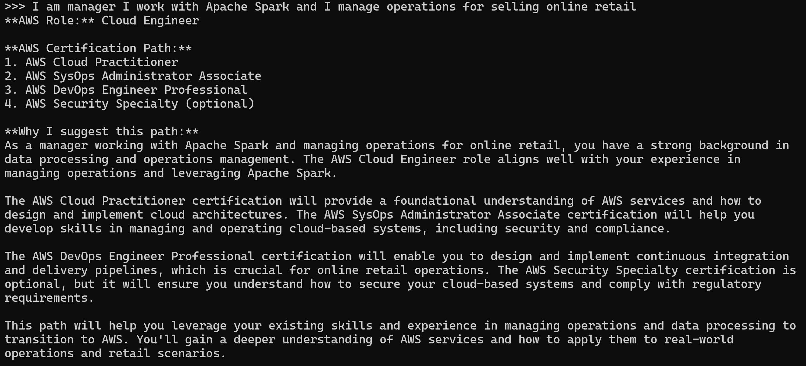
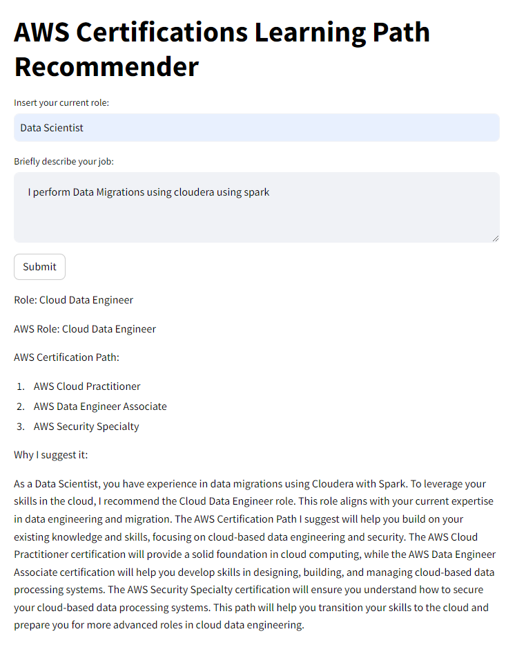

## AWS Path Learning Recommender
*ver May 2024*

## Description

The purpose of this repository is provide you a simple webapp that help you choose the best AWS Path Learning program based on you current Role of your Company.

The app recommend you the AWS Role and which AWS Certification path learnings fit better to you based in your input Role and experience.

## Setup
1. Clone the repository:
	```
	git clone https://github.com/ruslanmv/AWS-Path-Learning-Recommender/tree/main
	```
2. Install ollama from the following  [link](https://ollama.com/)
3. Create the model by using  Modelfile
	```
	ollama create aws-path-learning -f ./Modelfile
	```
## How to use
1. Go to the main root of the project
2. On the terminal, start the model by typing the comand
	```
	ollama run aws-path-learning
	```

And type your current role and what you do


3. Then run the script:
	```
	python stremlit run src/app.py
	```

